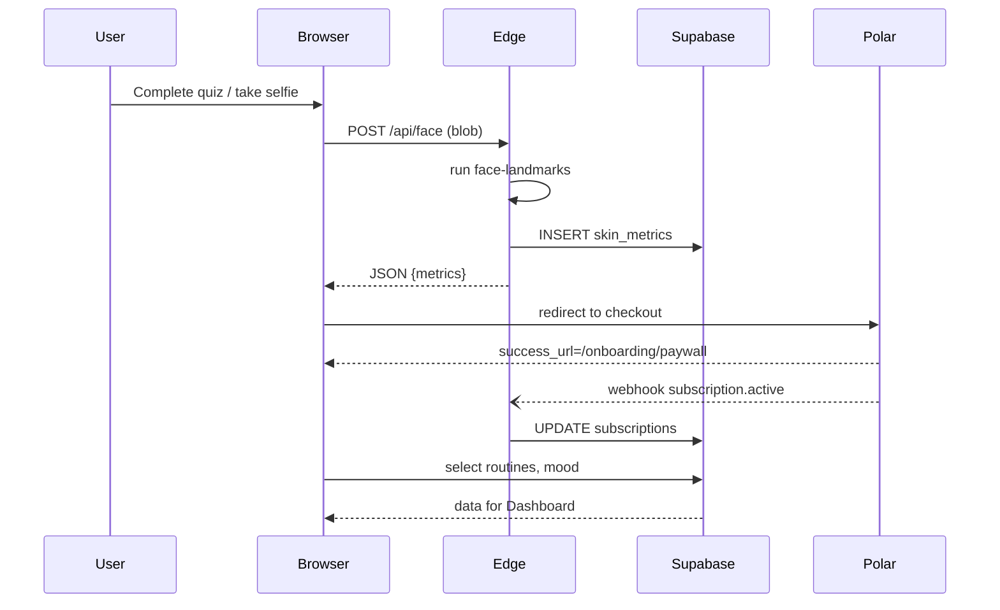

Below is a production-ready reference architecture you can copy-paste into your repo’s `README.md`. It lays out **what goes where, why it exists, and how data travels** through your Next .js + Supabase + Polar stack.

---

## TL;DR

A single **monorepo** hosts a Next.js 14 frontend (App Router), colocated **Edge Functions** (Route Handlers) that proxy heavy or privileged work, and an infra folder with migrations and CI.
Runtime state is split between a lightweight **Zustand store** on the client for ephemeral UI, **React Server Components** for per-request data, Supabase Postgres for long-lived records, and Polar for subscription status.
All services talk over HTTPS with JWT bearer tokens issued by Supabase; webhook events fan back into the same Edge layer so the browser never needs secret keys.

---

## 1 · Monorepo / Top-level Layout

```text
skincare-app/
├─ apps/
│  ├─ web/               # Next.js 14 (app/ router) – the only “frontend”
│  └─ face-worker/       # Optional Cloudflare Worker or Vercel Edge ML
├─ packages/
│  ├─ ui/                # shadcn/ui components + Tailwind config
│  ├─ lib/               # shared TS utilities (OpenAI, Polar SDK, etc.)
│  └─ db/                # generated Supabase types & Zod validators
├─ supabase/             # SQL migrations, storage rules, RLS policies
├─ scripts/              # one-off CLIs (seed DB, export CSV, etc.)
└─ .github/              # CI / CD (lint, type-check, e2e, deploy)
```

*Next.js encourages colocating route code under `app/`; Edge and Server Actions live right beside pages for tight latency.* ([Next.js][1])
*A monorepo keeps UI packages, serverless workers, and generated DB types in sync.* ([Reddit][2])

---

## 2 · Frontend (`apps/web/`)

### 2.1  Route Tree (App Router)

```text
app/
├─ (marketing)/              # static pages
│   └─ page.tsx
├─ (onboarding)/
│   ├─ welcome/page.tsx
│   ├─ quiz/[step]/page.tsx  # 1 question per route
│   ├─ face/page.tsx         # selfie capture
│   ├─ loading/page.tsx
│   ├─ email/page.tsx
│   └─ paywall/page.tsx
├─ dashboard/page.tsx
├─ chat/page.tsx
└─ layout.tsx
```

*Each sub-folder = a URL segment; adding `page.tsx` makes it routable* ([Next.js][1]).

### 2.2  Supporting Folders

| Folder        | Purpose                                                                                                               |
| ------------- | --------------------------------------------------------------------------------------------------------------------- |
| `components/` | Pure UI: inputs, sliders, coach chat bubbles                                                                          |
| `hooks/`      | `useOnboarding()`, `useWeather()`, etc.                                                                               |
| `stores/`     | Global **Zustand** stores (`useSessionStore`, `useQuizStore`) for client-only state ([Medium][3], [DEV Community][4]) |
| `lib/`        | Client helpers (`supabaseBrowser.ts`, `polarClient.ts`, `openai.ts`)                                                  |
| `styles/`     | Tailwind base + shadcn/theme                                                                                          |
| `app/api/`    | Route Handlers (Edge) – see §3                                                                                        |

---

## 3 · Edge Functions & Server Actions

| Path                             | Runs At  | What it does                                                                                                                                       |
| -------------------------------- | -------- | -------------------------------------------------------------------------------------------------------------------------------------------------- |
| `app/api/face/route.ts`          | **Edge** | Proxy the selfie blob to **face-worker** or `@tensorflow-models/face-landmarks-detection` and return JSON landmarks ([TensorFlow][5], [GitHub][6]) |
| `app/api/polar/webhook/route.ts` | **Edge** | Verify Polar signature, upsert `subscription_status` in Supabase ([Polar][7], [Polar][8])                                                          |
| `app/api/chat/route.ts`          | **Edge** | Stream OpenAI chat completions (coach) to the UI                                                                                                   |
| `app/api/weather/route.ts`       | **Edge** | Fetch OpenWeather and cache (60 s) for the dashboard ([OpenWeatherMap][9])                                                                         |

Edge locations trim TTFB compared with classic serverless functions. ([OpenStatus][10], [Vercel][11])

---

## 4 · Supabase Backend

### 4.1  Schema Highlights

| Table           | Key Columns                        | Notes                                              |
| --------------- | ---------------------------------- | -------------------------------------------------- |
| `users`         | `id`, `email`, `avatar_url`        | Managed by **Supabase Auth** JWTs ([Supabase][12]) |
| `quiz_answers`  | `user_id`, `question_id`, `answer` | Upsert per step                                    |
| `selfies`       | `user_id`, `taken_at`, `url`       | Raw uploads (Storage)                              |
| `skin_metrics`  | `user_id`, `score`, `landmarks`    | Face-analysis outputs                              |
| `routines`      | `user_id`, `date`, `steps` JSONB   | ≤ 3 products/day                                   |
| `moods`         | `user_id`, `date`, `emoji`, `note` | Quick tracker                                      |
| `subscriptions` | `user_id`, `polar_id`, `status`    | Synced via webhook                                 |

Storage buckets: `selfies/`, `progress/`. RLS policies lock rows to `user_id`.

### 4.2  Auth & Session

*`@supabase/auth-helpers-nextjs` provides a server component `createServerComponentClient()` so every route can grab `session` without extra fetches, while the Zustand `useSessionStore` mirrors it on the client.* ([Supabase][12], [Medium][3])

---

## 5 · Polar Payments

1. **Checkout** – call `polar.checkout.createSession()` from a Server Action.
2. **Webhook** – POST hits `/api/polar/webhook`. Edge handler verifies `signature` and updates `subscriptions`.
3. **Client gating** – a React hook reads `subscriptions.status`; if `"active"` the paywall route redirects to `/dashboard`.

Polar’s framework adapters make the above 3 calls trivial. ([Polar][7], [Polar][8])

---

## 6 · Client-Side State Strategy

| Layer             | Library                   | Scope            | Persistence               |
| ----------------- | ------------------------- | ---------------- | ------------------------- |
| **Ephemeral UI**  | React state / -transition | Each RSC         | None                      |
| **Cross-page UI** | **Zustand** (`stores/`)   | Browser tab      | localStorage (middleware) |
| **Auth**          | Supabase helper           | Browser & Server | HttpOnly cookie           |
| **Business data** | Supabase Postgres         | Cloud            | Postgres row              |

*Zustand’s subscribe/store model avoids React Context prop drilling and stays under 1 kB.* ([DEV Community][4])

---

## 7 · Key Data Flows



---

## 8 · Selfie Capture & Face Analysis

* Use `navigator.mediaDevices.getUserMedia({video: {facingMode:"user"}})` for the front camera, show live preview, then `canvas.toBlob()` for upload. ([MDN Web Docs][13], [Stack Overflow][14])
* Run `face-landmarks-detection` (TensorFlow\.js) either directly in the browser—if you need full offline—or streamed to an **Edge Worker** when you want consistent quality/control. ([TensorFlow][5], [GitHub][6])

---

## 9 · External APIs & Integrations

| Feature        | Edge Route       | 3rd-party   | Notes                                   |
| -------------- | ---------------- | ----------- | --------------------------------------- |
| Weather impact | `/api/weather`   | OpenWeather | Cache in KV 1 min ([OpenWeatherMap][9]) |
| Coach chat     | `/api/chat`      | OpenAI      | Streams SSE                             |
| Image storage  | Supabase Storage | —           | CDN-backed                              |

---

## 10 · Dev → Prod Pipeline

1. **PR checks** – ESLint, TypeScript, Vitest, Cypress.
2. **`turbo run build`** – outputs Next.js static + edge bundles.
3. **Vercel deploy** – sets `VERCEL_URL`, `SUPABASE_URL`, `POLAR_SECRET`.
4. **Supabase migrations** – Flyway/Prisma `supabase db push`.

---

